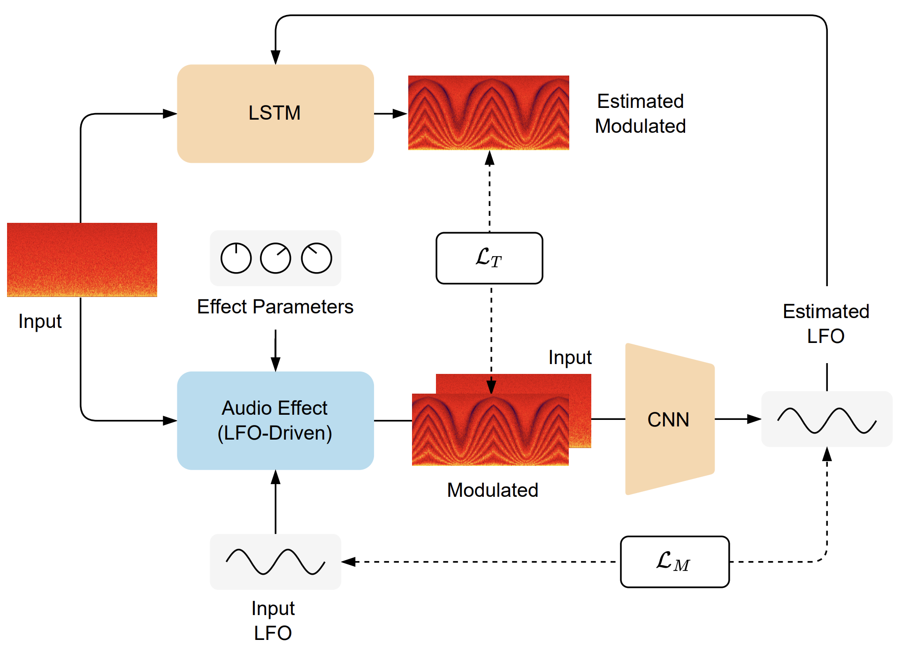

<h1>Modulation Extraction for LFO-driven Audio Effects</h1>

    <a href="https://christhetr.ee/" target=”_blank”>Christopher Mitcheltree</a>,
    <a href="https://www.christiansteinmetz.com/" target=”_blank”>Christian J. Steinmetz</a>,
    <a href="https://mcomunita.github.io/" target=”_blank”>Marco Comunità</a>, and
    <a href="https://www.eecs.qmul.ac.uk/~josh/" target=”_blank”>Joshua D. Reiss</a>

<h2>Links</h2>

[comment]: <> (<h3><a href="https://arxiv.com" target=”_blank”>Paper</a></h3>)
<h3><a href="docs/docs/dafx_2023_lfo_v2.pdf" target=”_blank”>Paper</a></h3>

<h3><a href="https://christhetree.github.io/mod_extraction/" target=”_blank”>Listening Samples and Plugins</a></h3>

<h2>Instructions for Reproducibility</h2>

<ol>
    <li>Clone this repository and open its directory.</li>
    <li>
    Install the requirements using  <code>conda env create --file=conda_env_cpu.yml</code> or  
    <code>conda env create --file=conda_env.yml</code>  for GPU acceleration.  
    <code>requirements_pipchill.txt</code> and <code>requirements_all.txt</code> are also provided as references, 
    but are not needed when using the <code>conda_env.yml</code> files.
    </li>
    <li>The source code can be explored in the <code>mod_extraction/</code> directory.</li>
    <li>All models from the paper can be found in the <code>models/</code> directory.</li>
    <li>Create an out directory (<code>mkdir out</code>).</li>
    <li>Create a data directory (<code>mkdir data</code>).</li>
    <li>
    Download the <a href="https://zenodo.org/record/7544110" target=”_blank”>IDMT-SMT-Guitar</a> and 
    <a href="https://zenodo.org/record/7044411#.YzRx2XbMKUl" target=”_blank”>EGFx</a> datasets and place their root 
    directories in the data directory.
    </li>
    <li>
    Rename the root directories of the datasets to <code>idmt_4</code>, <code>egfx_clean</code>, 
    <code>egfx_phaser</code>, <code>egfx_flanger</code>, and <code>egfx_chorus</code>.
    </li>
    <li>
    Use the methods in <code>scripts/split_datasets.py</code> to split each dataset into train, validation, and test 
    sets.
    </li>
    <li>Melda instructions TBD</li>
    <li>
    All models can be trained by modifying <code>scripts/train.py</code> and the corresponding 
    <code>configs/train_ ... .yml</code> config file and then running <code>python scripts/train.py</code>.  
    Make sure your PYTHONPATH has been set correctly by running a command like 
    <code>export PYTHONPATH=$PYTHONPATH:BASE_DIR/mod_extraction/</code>.
    </li>
    <li>
    All models can be evaluated by modifying <code>scripts/validate.py</code> and the corresponding 
    <code>configs/eval_ ... .yml</code> config file and then running <code>python scripts/validate.py</code>.
    </li>
    <li>
    <a href="https://neutone.space" target=”_blank”>Neutone</a> files for running the effect models as a VST can be  
    exported by modifying and running the <code>scripts/export_neutone_models.py</code> file.
    </li>
</ol>

<h2>Abstract</h2>

Low frequency oscillator (LFO) driven audio effects such as phaser, flanger, and chorus, modify
their input using time-varying filters and delays, resulting in characteristic sweeping or widening
effects.
It has been shown that these effects can be modeled using neural networks that are conditioned with
the ground truth LFO signal. However, in most cases this signal is not accessible and cannot be
easily measured from the output audio.
To address this, we propose a neural network that can accurately extract arbitrary LFO signals from
processed audio for multiple digital audio effects, parameter settings, and instrument
configurations.
Since our system imposes no restrictions on the LFO signal shape, we demonstrate its ability to
extract quasiperiodic, combined, and distorted modulation signals that are relevant to analog effect
modeling.
Furthermore, we show how coupling the extraction model with a simple processing network enables
training of end-to-end black-box models of unseen analog or digital LFO-driven audio effects from
just dry and wet audio pairs - hence overcoming the need to access the audio effect plugin or
internal LFO signal.
We make our code available and provide the trained audio effect models in a real-time VST plugin.

[comment]: <> (
)

[comment]: <> (<h2>Citation</h2>)

[comment]: <> (
)

[comment]: <> (<pre><code>)

[comment]: <> (@misc{mitcheltree2023modulation,)

[comment]: <> (      title={Modulation Extraction for LFO-driven Audio Effects},)

[comment]: <> (      author={Christopher Mitcheltree and Christian J. Steinmetz and Marco Comunità and Joshua D. Reiss},)

[comment]: <> (      year={2023},)

[comment]: <> (      eprint={TBD},)

[comment]: <> (      archivePrefix={arXiv},)

[comment]: <> (      primaryClass={cs.SD}})

[comment]: <> (</code></pre>)

[comment]: <> (
)
